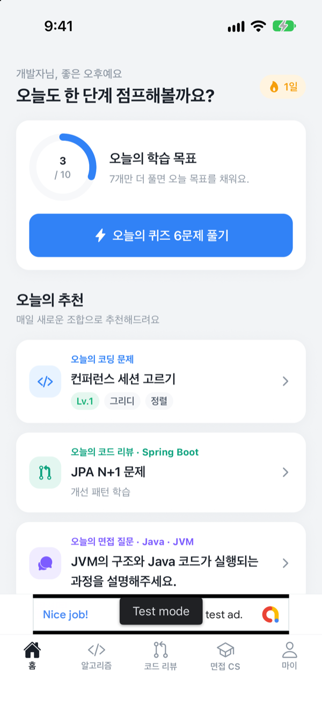
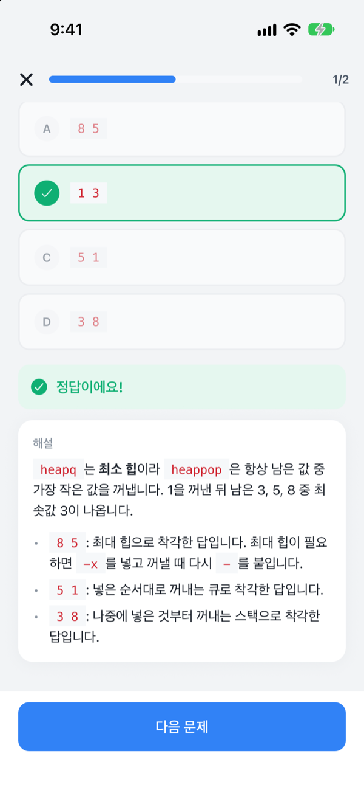
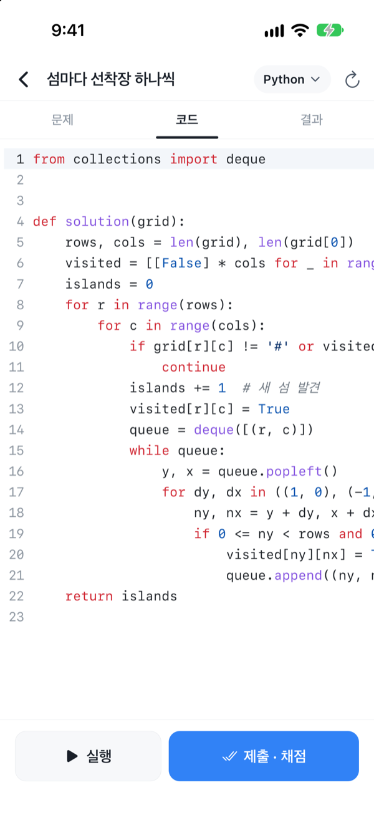
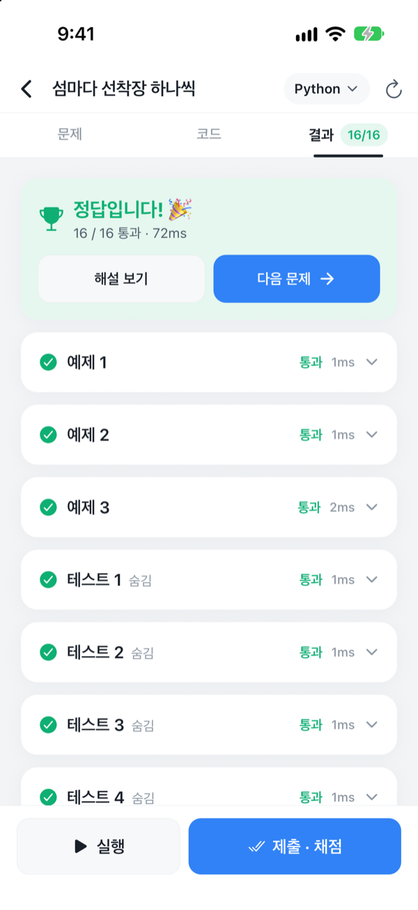
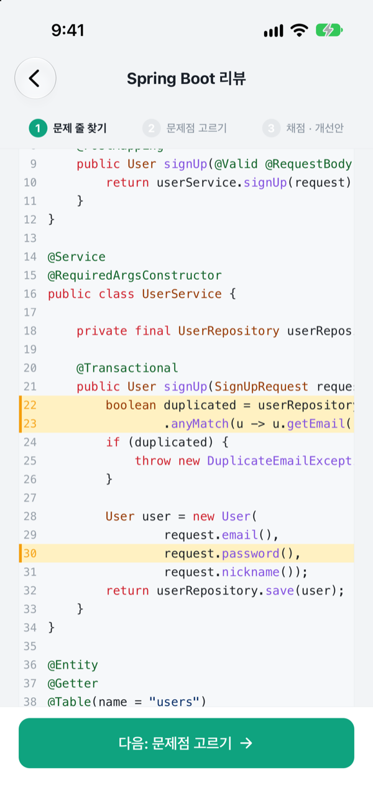
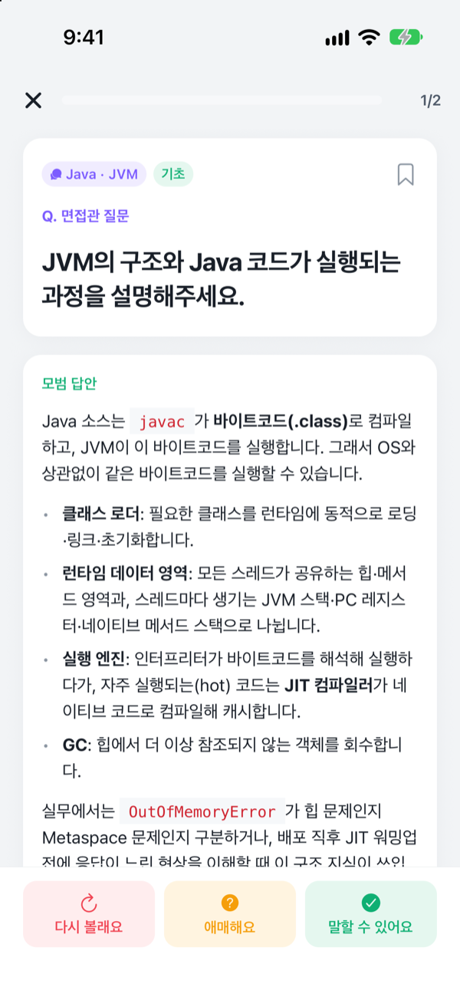
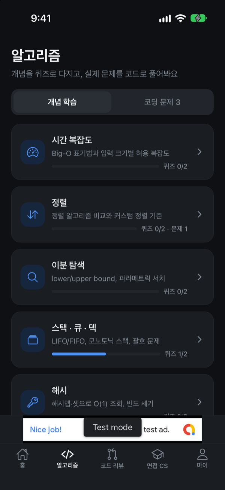

# To Jump Programmer — 개발자 취업·이직 준비 앱

코딩 테스트, 코드 리뷰 테스트, 기술 면접을 **한 앱에서** 준비하는 모바일 학습 앱입니다.
하루 10분씩 퀴즈·문제·면접 카드로 꾸준히 학습하도록 설계했습니다.

| 트랙 | 기능 |
| --- | --- |
| **알고리즘 · 코딩 테스트** | 14개 토픽 개념 정리 + 개념 퀴즈 112문항 · 프로그래머스 형식 코딩 문제 29개를 Python · Java · Kotlin · C++ · JavaScript 로 직접 풀고 채점 (힌트 · 해설 · 5개 언어 모범 답안) |
| **코드 리뷰 테스트** | Spring Boot(Java · Kotlin 전환) / Node.js·NestJS / Django·Flask 별 **개선 패턴 학습** 10개(개선 전·후 코드, 변경점 diff, 리뷰 체크리스트)와 **리뷰 실전 퀴즈** 6개(문제 줄 찾기 → 문제점 고르기 → 채점 · 모범 리뷰 · 베스트 개선안) — 총 48개 |
| **기술 면접 CS** | 15개 카테고리(OS · 네트워크 · 자료구조 · DB · 보안 · Java · JS/TS · Python · Spring · NestJS · Django · 아키텍처 · 인프라 · OOP · 실무) 퀴즈 225문항 + 면접 질문 카드 120장(모범 답안 · 핵심 키워드 자가 체크 · 꼬리 질문) |
| **학습 관리** | 오늘의 추천 · 하루 목표 · 연속 학습일 · 학습 잔디 · 오답노트 · 북마크 · 다시 볼 카드 · 다크 모드 |

> 코딩 문제의 테스트 케이스는 5개 언어 모범 답안을 실제로 실행해 검증합니다 (`npm run validate`).
>
> **이 공개 저장소에는 샘플 콘텐츠만 들어 있습니다.** 전체 학습 콘텐츠는 비공개 저장소로 관리하며, 샘플만으로도 앱의 모든 기능을 실행해 볼 수 있습니다. ([콘텐츠 구성](#콘텐츠-구성))

## 스크린샷

| 홈 · 오늘의 추천 | 개념 퀴즈 · 해설 | 코드 에디터 | 채점 결과 |
| :---: | :---: | :---: | :---: |
|  |  |  |  |

| 코드 리뷰 퀴즈 | 면접 질문 카드 | 다크 모드 |
| :---: | :---: | :---: |
|  |  |  |

<sub>iPhone 17 시뮬레이터(iOS 27)에서 이 저장소의 샘플 콘텐츠로 촬영했습니다. 하단 배너는 개발 빌드에 나오는 Google 테스트 광고입니다.</sub>

---

## 기술 스택

서버 운영 비용 없이 앱 스토어에 출시할 수 있는 구성을 목표로 했습니다.

| 영역 | 선택 | 이유 |
| --- | --- | --- |
| 앱 | **Expo SDK 57 (React Native 0.86) + TypeScript** | iOS · Android(· 웹)를 하나의 코드로. EAS 클라우드 빌드로 스토어 출시 |
| 라우팅 | Expo Router (파일 기반) | 탭 + 스택 네비게이션, 딥링크 기본 지원 |
| 상태·저장 | Zustand + AsyncStorage | 학습 기록을 **기기에만 저장** → 서버·DB 없이 동작, 운영자가 수집하는 개인정보 없음 |
| 콘텐츠 | 앱 번들에 포함된 TypeScript 데이터 | CMS·API 서버 불필요. 콘텐츠 수정은 EAS Update(OTA)로 배포 |
| 코드 에디터 | CodeMirror 6 (WebView 내장, 오프라인) | 구문 강조 · 자동 들여쓰기 · 괄호 짝 · 모바일 입력 지원 + 기호 입력 툴바 |
| 코드 실행 | **기기 내 샌드박스**: Python(Pyodide/WebAssembly) · JavaScript(Web Worker) | 서버 없이 채점. Worker 를 강제 종료해 무한 루프에도 앱이 멈추지 않음 |
| 코드 실행 (선택) | Java · Kotlin · C++: **Piston**(오픈소스) 자가 호스팅 | 저사양 서버 1대로 운영. 서버가 없어도 앱의 나머지 기능은 모두 동작 |
| 수익화 | **Google AdMob** (`react-native-google-mobile-ads`) | 무료 앱 + 광고. 동의(UMP) · iOS 추적 허용(ATT) 처리 포함 |

---

## 주요 구현

### 코드 실행 · 채점

```text
[풀이 화면] ─ 실행/제출 ─▶ runSolution()
   ├─ Python / JavaScript ─▶ 숨김 WebView(네이티브) / 브라우저(웹)
   │      └─ 매니저가 언어별 Module Worker 관리 · 케이스별 제한 시간 초과 시 terminate
   │          ├─ JavaScript: new Function 으로 solution 실행
   │          └─ Python: Pyodide(CPython→WASM, 최초 1회 CDN 다운로드 후 캐시)
   └─ Java / Kotlin / C++ ─▶ 채점 하네스 코드 생성(테스트 입력을 리터럴로 삽입)
          └─ Piston /api/v2/execute ─▶ 표준 출력 마커 파싱 → 케이스별 결과
```

- 채점은 프로그래머스처럼 `solution` 함수의 **반환값**을 비교합니다. `print`/`console.log` 출력은 케이스별로 따로 보여줍니다.
- 에러 메시지의 줄 번호는 하네스 코드를 제외한 **사용자 코드 기준**으로 바꿔 표시합니다.
- Java · Kotlin · C++ 실행 서버(Piston + Caddy 자동 HTTPS)는 [`infra/runner`](infra/runner) 의 docker-compose 로 띄우고, 앱의 마이 › 설정에서 서버 주소를 입력해 연결합니다.

### 코드 리뷰 언어 전환 (Spring Boot: Java · Kotlin)

- 같은 개선 패턴 · 리뷰 퀴즈를 Java 와 Kotlin 코드로 모두 제공합니다. 처음에는 코딩 문제 풀이 언어를 따라가고, 화면의 칩으로 바꿀 수 있습니다.
- 언어 버전 콘텐츠는 코드와 채점 줄 번호만 새로 쓰고, 설명은 그 언어에서 달라지는 필드만 덮어씁니다. 검증 스크립트가 숨겨진 이슈 수 · 줄 번호 · 덮어쓰지 않은 Java 코드 예시를 검사합니다.

### 광고

| 위치 | 형식 | 규칙 |
| --- | --- | --- |
| 탭 화면 하단(탭 바 위) | 배너 (320×50) | 항상. 불러오지 못하면 자리를 차지하지 않음 |
| 퀴즈 · 면접 카드 · 코드 리뷰 퀴즈 · 코딩 문제를 마치고 나갈 때 | 전면 광고 | 세션 2번 마칠 때마다 1번, 앱 실행 직후·직전 광고 후 3분간 노출 안 함 |

- 문제를 푸는 중(퀴즈 진행 · 코드 에디터 · 카드 학습)에는 광고를 띄우지 않습니다.
- AdMob ID 는 저장소에 넣지 않고 빌드 환경 변수로 주입하며, 값이 없으면 Google 테스트 광고로 동작합니다.
- 광고 SDK 가 없는 Expo Go · 웹에서는 광고 없이 동작합니다.

---

## 콘텐츠 구성

| 위치 | 내용 | 공개 여부 |
| --- | --- | --- |
| `src/content/types.ts` 와 토픽·카테고리 목록 | 콘텐츠 스키마 | 공개 |
| `src/content/sample/` | 토픽마다 일부만 담은 샘플 | 공개 |
| 비공개 저장소 | 전체 학습 콘텐츠 (퀴즈 · 코딩 문제 · 코드 리뷰 · 면접 카드) | 비공개 |
| `src/content/data/` | 앱이 실제로 읽는 콘텐츠. `npm run content:sync` 가 전체 콘텐츠(없으면 샘플)를 복사 | git 제외 |

스토어 출시용(`production`) 빌드는 `src/content/data` 가 전체 콘텐츠가 아니면 실패하도록 해, 샘플로 출시되는 것을 막습니다.
콘텐츠 형식과 작성 규칙은 [`docs/CONTENT_GUIDE.md`](docs/CONTENT_GUIDE.md) 에 있습니다.

---

## 실행하기

```bash
npm install        # 설치 후 학습 콘텐츠를 자동으로 준비 (전체 콘텐츠가 없으면 샘플)
npm start          # Expo 개발 서버 (QR 코드를 Expo Go 앱으로 스캔)
npm run web        # 브라우저에서 실행
```

광고까지 확인하려면 개발 빌드(`npx expo run:ios` / `npx expo run:android`)로 실행합니다.

| 명령 | 설명 |
| --- | --- |
| `npm run typecheck` | 앱 · 스크립트 · 에디터 타입 검사 |
| `npm run lint` | ESLint (React Compiler 규칙 포함) |
| `npm test` | 핵심 로직 테스트 (마크다운 파서 · diff · 채점 비교 · 출력 파서 · 연속 학습일) |
| `npm run test:harness` | Java · Kotlin · C++ 채점 하네스 테스트 (JDK, kotlinc, g++/clang++ 필요) |
| `npm run validate` | 콘텐츠 구조 검증 + 코딩 문제 모범 답안 5개 언어 실행 검증 (python3, node, JDK 15+, kotlinc, g++/clang++ 필요) |

---

## 프로젝트 구조

```text
src/
  app/                      # 화면 (Expo Router)
    (tabs)/                 #   홈 · 알고리즘 · 코드 리뷰 · 면접 CS · 마이
    algorithm/              #   토픽 개념 정리 · 문제 상세 · 코드 풀이(에디터/실행/채점)
    review/                 #   개선 패턴 학습 · 리뷰 실전 퀴즈
    interview/[id].tsx      #   CS 카테고리 상세
    quiz.tsx · cards.tsx    #   퀴즈 세션 · 면접 카드 세션
    notes · bookmarks · settings · privacy · onboarding
  components/               # UI 컴포넌트 (코드 블록 · diff · 마크다운 렌더러 · 실행 결과 등)
  content/                  # 학습 콘텐츠 (스키마 · 토픽/카테고리 목록 · 진입점)
    sample/                 #   공개용 샘플 콘텐츠
    data/                   #   앱이 읽는 콘텐츠 (git 제외)
  features/
    runner/                 # 코드 실행·채점
      core/                 #   시작 코드 · Java/Kotlin/C++ 채점 하네스 생성 · 결과 비교 (Node 에서도 재사용)
      sandbox/              #   Web Worker 샌드박스 (Python/Pyodide, JavaScript)
      remote.ts             #   Piston 클라이언트 (Java/Kotlin/C++)
    editor/                 # CodeMirror WebView/iframe 래퍼 · 키보드 툴바
    progress/               # 학습 기록 저장소 · 통계 · 오늘의 추천
    ads/                    # AdMob 광고 (하단 배너 · 전면 광고 · 동의/ATT)
  lib/                      # markdown-lite 파서 · 구문 강조 · diff · 날짜 유틸
  theme/                    # 디자인 토큰 (라이트/다크)
editor/src/main.ts          # 내장 코드 에디터 소스 (esbuild 로 번들)
scripts/                    # 콘텐츠 동기화·검증 · 에디터 번들 · 아이콘 생성
infra/runner/               # Java·Kotlin·C++ 실행 서버 (Piston + Caddy HTTPS) docker-compose
plugins/                    # 로컬 Expo config plugin (iOS UIScene 생명주기)
docs/                       # 콘텐츠 작성 가이드 · 개인정보 처리방침 · 스크린샷
```

---

## 로드맵

- 프론트엔드 트랙 (React · Next.js 코드 리뷰, 브라우저/프론트 CS)
- 계정 · 기기 간 학습 기록 동기화
- 콘텐츠 원격 업데이트 (앱 업데이트 없이 문제 추가)
- 대용량 입력 기반 효율성 테스트, 문제 수 확대
- Java · Kotlin · C++ 기기 내 실행 (WebAssembly 기반 컴파일러/JVM 검토) — 서버 없이 모든 언어 채점
- 면접 답변 음성 녹음 · 셀프 피드백
- 광고 제거 인앱 결제

## 오픈소스

Expo · React Native · CodeMirror 6 · Pyodide · Piston(서버, 선택) 을 사용합니다. 각 프로젝트의 라이선스를 따릅니다.

## 라이선스

Copyright (c) 2026 lgm1007. All rights reserved.
포트폴리오·참고 목적으로 열람만 허용하며, 코드와 학습 콘텐츠의 사용·복제·배포는 허용하지 않습니다. 자세한 내용은 [`LICENSE`](LICENSE) 를 참고하세요.
